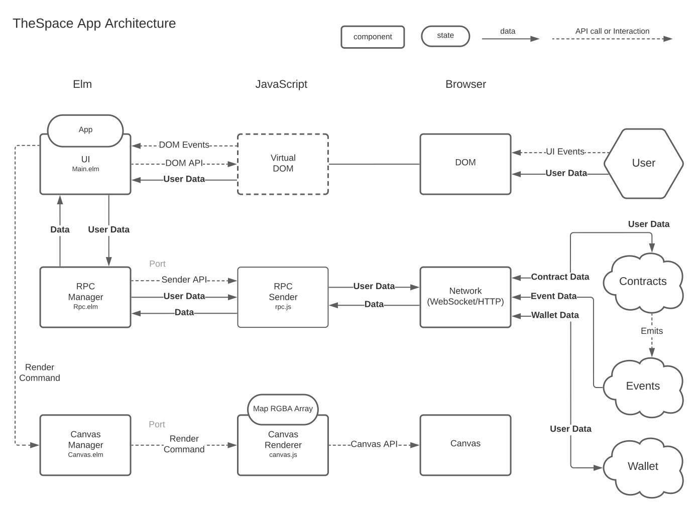

Source code of [TheSpace](https://thespace.game) official client app.

## Development

### Install Tools

- Elm v0.19 https://guide.elm-lang.org/install/
- Node/NPM (recent version) https://docs.npmjs.com/cli/v8/configuring-npm/install
- make

### Install project development dependencies

```
npm install --only-dev
```

### Auto recompile watcher

```
npx elm-live src/Main.elm --no-server -- --output=src/Native/elmapp.js
```

*Note: ```src/Native/elmapp.js``` is in .gitignore*

### Auto reload HTTP dev server

```
npx live-server --watch=src/Native/ --port=4000 --open=public
```

- app running at: http://127.0.0.1:4000/public/index.html

*Note: here we only use elm-live for auto re-compilation and live-server for auto reloading.*

### Env Management (production/staging/development)

### Switch env

```
cp src/Env/(Production|Staging|Development).env src/Env.elm
```

### Backup current env

```
make backupEnv
```

This will back up ```src/Env.elm``` to ```src/Env.bak```.


### Restore backup env

```
make restoreEnv
```

This will restore ```src/Env.bak``` to ```src/Env.elm```, and use ```src/Env/Development.env``` if ```src/Env.bak``` not exists.*


## Release

```
make release
```

This will:
1. backup current env
2. switch to production env
3. compile and bundle current code to ```-optimized``` build to ```public/app.js```
4. uglify and minify ```public/app.js``` to ```public/app.min.js```
5. generate ```public/release.html``` using MD5 checksum of ```app.min.js``` as version(```?v=version```).
6. remove ```public/app.js```
7. restore backed up env

## Notes on CI

- release version of ```app.min.js``` and ```release.html``` are checked into git in the ```public/``` folder.
- ```release.html``` import ```app.min.js``` as ```<script src="./app.min.js?v=$(md5_of_app.min.js)"></script>```
- It's CI's job to rename these files and put them on to hosting service at the correct path.


## App Architecture


